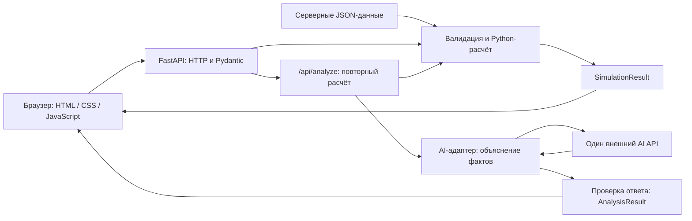

# Минимальная архитектура MVP «Аким на 5 часов»

Статус: решение зафиксировано до реализации. Этот документ согласован со [спецификацией](spec.md), [API-контрактом](api-contract.md) и [README](../README.md). Контракт `2.0`, данные `city-v1`, правила `five-directions-v1`. Код приложения на этом этапе не создаётся.

## 1. Решение

Одно приложение FastAPI обслуживает HTML/CSS/JavaScript и JSON API на одном origin. Один процесс запускает UI, валидацию, расчёт и обращение к одному внешнему AI-провайдеру. Для MVP не нужны БД, авторизация, отдельный frontend-сервер, Redis, очередь, RAG, агентный фреймворк или дополнительные сервисы. Предыдущая ветка backend не диктует числовую модель.



Схема показывает внутренние модули одного процесса. Вызов расчёта из `/api/analyze` — обычный вызов Python-функции, не HTTP-запрос приложения к самому себе. Проверка входа и расчёт предшествуют любому обращению к AI.

## 2. HTTP-поверхность

| Метод | Путь | Ответственность |
| --- | --- | --- |
| GET | `/` | Отдать `static/index.html` |
| GET | `/static/*` | Локальные CSS/JS и другие статические ресурсы |
| GET | `/api/config` | ConfigResponse: единый каталог, правила, базовый Score и версии |
| POST | `/api/simulate` | SimulationRequest → валидация → расчёт → SimulationResult; без LLM |
| POST | `/api/analyze` | Тот же SimulationRequest → повторная валидация и расчёт → LLM → AnalysisResult |
| GET | `/health` | Только `{"status":"ok"}`, без обращения к провайдеру |

Статика монтируется только под `/static`, а `/` отдаёт index.html отдельным маршрутом. Mount на `/` не используется: он не должен перехватить `/api/*` и `/health`. Отдельный CORS-контур при одном origin не нужен. Дублирующих маршрутов без `/api` нет.

Оба POST получают только такой объект; бюджет, эффект и Score не принимаются:

```json
{
  "selections": [
    {"measure_id": "M1", "district_id": "esil"},
    {"measure_id": "M4", "district_id": "saryarka"},
    {"measure_id": "M7", "district_id": "nura"},
    {"measure_id": "M10", "district_id": "esil"},
    {"measure_id": "M12", "district_id": null}
  ]
}
```

`selections` — единственное поле верхнего уровня. Внутри Selection разрешены только `measure_id` и `district_id`. Ровно пять разных мероприятий, по одному каждой категории. Для district район обязателен, для city разрешены null или отсутствие поля. Bare array и имя `decisions` не являются поддерживаемыми альтернативами.

## 3. Модули и границы

| Планируемый файл | Ответственность | Не делает |
| --- | --- | --- |
| `app/main.py` | Создаёт приложение, загружает/проверяет данные при старте, объявляет маршруты и общий обработчик ошибок | Не содержит вторую реализацию формулы |
| `app/models.py` | Pydantic-структуры запросов и ответов; фиксированные типы ID, правила сериализации | Не обращается к LLM или файловой системе |
| `app/validator.py` | Проверяет количество, ID, категории, районы, конфликты и бюджет | Не меняет исходные показатели |
| `app/simulation.py` | Чистые функции базовой оценки и симуляции; расчёт только по spec | Не вызывает сеть, AI, HTTP или чтение файлов |
| `app/ai.py` | Один API-клиент; запрос с фактами; timeout; проверка Analysis и evidence_paths | Не считает и не исправляет Score |
| `app/prompts/analyst.txt` | Учебная роль, формат ответа, запрет на выдуманные числа | Не заменяет серверную валидацию |
| `data/districts.json` | Исходные районы, население, показатели и веса | Не хранит попытки пользователей |
| `data/measures.json` | Каталог M1–M14, правила и параметры модели | Не содержит API-ключей |
| `static/index.html`, `styles.css`, `app.js` | Форма, события, запросы, числа и AI-текст | Не является источником стоимости или формулы |

Функция симуляции получает selections и проверенный snapshot данных, возвращает SimulationResult и не меняет snapshot. Валидация вызывается из этой же функции, поэтому оба POST используют один путь правил и расчёта. Неверный запрос прекращает обработку до AI. Не создавать отдельную копию логики для `/api/analyze`.

## 4. Данные и версии

Два JSON-файла загружаются один раз при запуске. Один неизменяемый snapshot обслуживает все попытки; перезагрузка данных на каждом запросе не нужна. Для расчёта создаётся рабочая копия показателей. Конфигурация браузера и движок читают один snapshot.

Форма файлов до реализации:

- `districts.json`: объект с `dataset_version`, `indicators`, `indicator_labels`, `weights`, `districts`. Структуры полей соответствуют ConfigResponse.
- `measures.json`: объект с `dataset_version`, `rules_version`, `budget`, `horizon_quarters`, `required_selection_count`, `required_categories`, `max_per_category`, `categories`, `measures`, `conflicts`, `synergies`.
- `contract_version="2.0"` — константа API; ConfigResponse собирается из проверенных полей двух файлов, этой константы и рассчитанного baseline_score.

dataset_version в обоих файлах должна совпадать. При старте проверяются пять уникальных районов, десять показателей, 14 мер, ссылки конфликтов/синергий, суммы весов и долей 1, диапазон показателей 0–100, допустимые категории, неотрицательные целые стоимости и лаги 0–8. Ошибка данных останавливает успешный запуск; не подставлять другие значения для получения ожидаемого балла.

| Версия | Значение | Что обозначает |
| --- | --- | --- |
| Контракт | `2.0` | Пути и схемы HTTP; заменяет `1.0` с путями без `/api` |
| Данные | `city-v1` | Числа пяти районов, веса и каталог исходного документа |
| Правила | `five-directions-v1` | Формула и строгий выбор одной меры на направление |

Версии возвращаются в `/api/config`, SimulationResult и AnalysisResult. Их нельзя выбрать или переопределить через POST. При изменении чисел/правил/схемы обновляется соответствующая версия; точные границы описаны в API-контракте.

Фиксированные DistrictID и порядок: `esil` — Есиль; `almaty` — Алматы; `saryarka` — Сарыарка; `baikonur` — Байконур; `nura` — Нура. Названия в UI не используются в качестве ID. Категории: `transport`, `environment`, `social`, `safety`, `services`.

## 5. Результаты и ошибки

Подробные типы и полные JSON-примеры находятся в [API-контракте](api-contract.md); ниже краткая граница ответственности.

| Структура | Содержание |
| --- | --- |
| SimulationResult | Версии; нормализованные selections; baseline_score, final_score, score_delta; total_cost и remaining_budget; score_breakdown; пять районов до/после; critical_before/after; applied_effects и applied_synergies; детерминированный explanation с explanation_source=rules |
| AnalysisResult | Версии; нормализованные selections; заново рассчитанные baseline_score и final_score; status; analysis либо null; unavailable_reason либо null; message |
| Analysis | summary, strengths, risks, tradeoff, reflection_question, limitations; фактические тезисы с evidence_paths |
| Ошибка 422 | `detail` — массив с одной первой ошибкой: code, message, path, context. Score отсутствует |

Имена SimulationResult и AnalysisResult — названия типов, не внешние обёртки JSON. Все поля AnalysisResult, кроме вложенного analysis, заполняет сервер. LLM не получает права формировать серверные версии, стоимость, selections или Score.

Ошибки 422 объединяют проблемы формата и бизнес-правил: неизвестные поля/ID, количество, повтор, район, категория, несовместимость, перерасход. Порядок проверок и коды зафиксированы в контракте, клиент работает по code. Одинаковый невалидный запрос к обоим POST возвращает одинаковую причину и не вызывает LLM. Непредвиденная ошибка расчёта — 500 с безопасным сообщением.

Недоступность AI для допустимого набора — HTTP 200, status=unavailable, analysis=null и явная причина. Это не ошибка пользовательского решения и не успешный AI-разбор. Числа остаются видны; автоматического fallback к другому провайдеру нет.

## 6. Два потока выполнения

**Расчёт:** UI фиксирует выбор → POST `/api/simulate` → Pydantic и бизнес-валидация → расчёт по серверному snapshot → SimulationResult → UI сразу показывает числа. Базовый эталон 52.55768; примеры A/B — 53.8250475 и 55.0703475 при стоимости 83.

**Разбор:** UI отправляет тот же snapshot выбора в `/api/analyze` → сервер независимо повторяет валидацию и расчёт → передаёт LLM проверенный результат → проверяет Analysis → возвращает AnalysisResult. Сервер не принимает готовый результат из браузера и не рассчитывает на результат предыдущего запроса. Сессия или запись попытки для этого не нужны.

JSON Pointer-пути evidence_paths проверяются относительно заново рассчитанного SimulationResult. UI разрешает те же пути относительно своего результата только при совпадении selections, версий и номера попытки. Корректная ссылка не гарантирует правильность интерпретации; разборы demo проверяются человеком.

При изменении выбора frontend увеличивает локальный номер попытки, отмечает прежний результат устаревшим и игнорирует поздние ответы. Номер не передаётся серверу и не требует базы данных. Один LLM-запрос на попытку; целевой общий timeout 12 секунд, включая настройки SDK, без скрытых повторов. Асинхронный вызов провайдера не должен блокировать обработку `/api/simulate` и `/health`.

## 7. Окружение и запуск

Планируется один процесс Uvicorn/FastAPI из корня репозитория. Точные проверенные команды и версии зависимостей будут внесены в README при реализации. Сейчас команды не выдаются за работающий запуск.

Настройки сервера: `AI_API_KEY`, `AI_MODEL`, при необходимости `AI_BASE_URL`, `AI_TIMEOUT_SECONDS`, `AI_ENABLED`. Ключ только в локальном окружении; `.env` исключается из Git; `.env.example` без секретов. Отсутствие AI-ключа отключает разбор, но не препятствует запуску конфигурации, статики, health и математической части.

Бюджет, веса, эффекты и правила хранятся в проверенном датасете. Не добавлять их как пользовательские настройки окружения. Все статические файлы локальные. Docker, отдельный reverse proxy, CI/CD, балансировщик и инфраструктура масштабирования не являются требованиями этого MVP.

## 8. Передача в реализацию

- Frontend использует `/api/*`, единственное поле selections, фиксированные ID и mock-ответы из API-контракта.
- Backend реализует одну функцию расчёта, общую для обоих POST, модели SimulationResult/AnalysisResult и единые ошибки 422.
- Data/QA переносит точные таблицы, проверяет базу/A/B и ошибки, затем воспроизводимость запуска.
- Ни один участник не меняет имена полей или пути односторонне. Изменение сначала отражается в общем контракте, примерах и README.

Этап завершён, когда документы не противоречат друг другу, JSON-примеры читаются, поля/ID/версии совпадают и числовые эталоны сохранены. Это фиксация архитектуры до реализации, а не подтверждение работы приложения.
